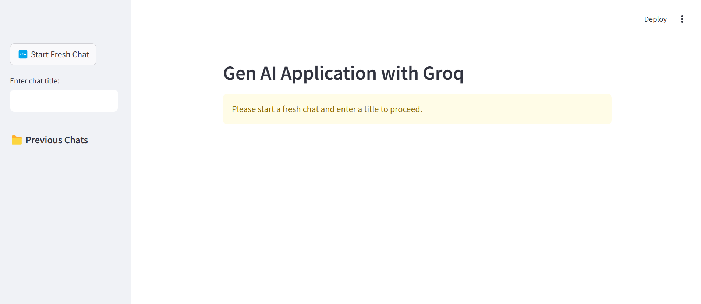
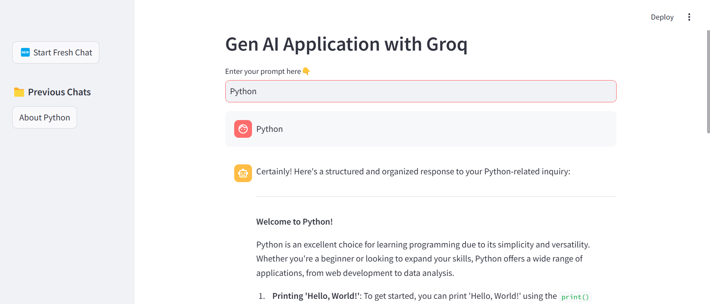
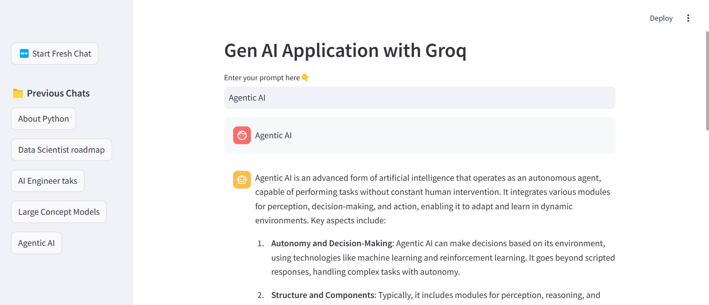

AI Assistant Web App

Overview

This is a powerful AI-powered web application built using Streamlit and integrated with the Groq API. The assistant provides intelligent responses and an interactive user experience, making it easy to engage with AI-driven conversations in a simple web interface.

Features

Seamless AI Interaction: The assistant is capable of generating meaningful and context-aware responses.

User-Friendly Interface: Built using Streamlit, ensuring a smooth and intuitive experience.

Efficient API Integration: Utilizes the Groq API to process user queries and provide intelligent replies.

Quick Deployment: Can be hosted easily on cloud platforms like Streamlit Sharing, Hugging Face Spaces, or your own server.

Lightweight and Fast: Optimized for quick responses and minimal latency.

Installation and Usage

Prerequisites

Ensure you have Python installed on your system. You will also need the following dependencies:

pip install streamlit requests

Running the App

Clone the repository and navigate to the project directory:

git clone <repository-url>
cd <project-folder>

Run the application using Streamlit:

streamlit run app.py

Screenshots

Below are some screenshots showcasing the functionality of the AI assistant:

